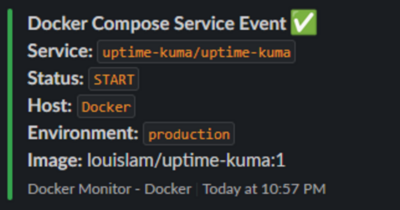
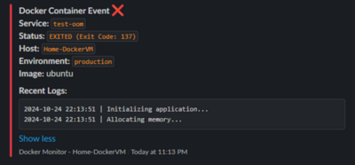
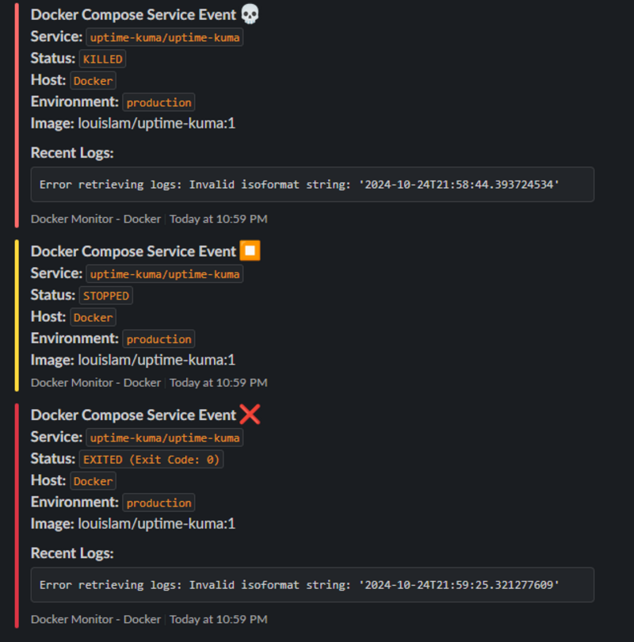

# 🔮 Harbinger

A vigilant messenger that watches over your Docker containers and reports their status to Slack. Like a digital herald for your containerized applications, Harbinger provides real-time notifications about container lifecycle events.


## 🌟 Features

- 📊 Real-time monitoring of Docker container events
- 🐳 Support for both standalone containers and docker-compose services
- 🔔 Elegant Slack notifications with detailed container information
- 📝 Automatic log capture when containers exit
- 🎨 Color-coded status messages for different events
- ⚡ Low overhead and resource usage
- 🛠️ Easy configuration through environment variables

## 📋 Prerequisites

- Python 3.6+
- Docker Engine
- Slack Webhook URL
- Linux environment (tested on Ubuntu)

## 🚀 Quick Start

1. **Clone the repository**
```bash
git clone https://github.com/luis15pt/Harbinger.git
cd Harbinger
```

2. **Install dependencies**
```bash
pip install -r requirements.txt
```

3. **Configure environment variables**
```bash
# Create .env file
cp .env.example .env

# Edit your configuration
vim .env
```

4. **Run as a service**
```bash
# Copy service file
sudo cp harbinger.service /etc/systemd/system/

# Enable and start service
sudo systemctl enable harbinger
sudo systemctl start harbinger
```

## ⚙️ Configuration

Create a `.env` file with the following variables:

```ini
SLACK_WEBHOOK_URL=https://hooks.slack.com/services/YOUR/WEBHOOK/URL
MONITOR_ENV=production
MONITOR_HOST=your-host-name
LOG_LINES=5
```

## 🔍 Example Notifications

Harbinger provides detailed, color-coded notifications for various container events:

- 🟢 Container starts

- 🔴 Container exits (with error codes)

- 💀 Container kills

- 🔄 Container restarts


## 🛠️ Running as a Service

Harbinger can be run as a systemd service for reliable operation:

```ini
[Unit]
Description=Harbinger Docker Monitor
After=docker.service
Requires=docker.service

[Service]
Type=simple
User=root
Group=docker
Environment=PYTHONUNBUFFERED=1
WorkingDirectory=/path/to/Harbinger
ExecStart=/usr/bin/python3 harbinger.py
Restart=always
RestartSec=10

[Install]
WantedBy=multi-user.target
```

## 📝 Logs

Monitor Harbinger's operation through its logs:

```bash
# View service logs
sudo journalctl -u harbinger -f

# Check application logs
tail -f /var/log/harbinger.log
```

## 🐋 Docker Compose Support

Harbinger automatically detects and provides additional context for docker-compose services, including:

- Project name
- Service name
- Container relationships
- Compose-specific events

## 🧪 Testing the Alert System

After setting up Harbinger, you can verify it's working correctly using these test scenarios:

### Basic Container Test
```bash
# Start a test container that exits immediately
docker run --name test-container alpine echo "Hello Harbinger!"
# This will trigger both START and EXIT notifications
```

### Test Container with Logs
```bash
# Run a container that generates multiple log lines
docker run --name test-logs alpine sh -c '
    echo "Starting application..."
    echo "Loading configuration..."
    echo "Simulating error..."
    exit 1
'
# This will show EXIT notification with logs
```

### Test Container Crash
```bash
# Simulate a container crash with error code
docker run --name test-crash alpine sh -c '
    echo "Running..."
    sleep 1
    echo "About to crash..."
    kill -9 1
'
# This will trigger an error exit notification
```

### Docker Compose Test
```bash
# Create a test docker-compose.yml file
cat << EOF > test-compose.yml
version: '3'
services:
  web:
    image: nginx
    ports:
      - "8080:80"
EOF

# Start the service
docker-compose -f test-compose.yml up -d

# Wait a few seconds, then stop it
docker-compose -f test-compose.yml down
```

### Memory Limit Test
```bash
# Test container with memory limit
docker run --name test-oom \
    --memory=10m \
    alpine sh -c 'cat /dev/zero > /dev/null'
# This will trigger an OOM (Out of Memory) exit
```

### Container Kill Test
```bash
# Start a container
docker run -d --name test-kill alpine sleep 3600

# Wait a moment, then kill it
docker kill test-kill
# This will show a KILLED notification
```

### Cleanup
```bash
# Remove all test containers
docker rm -f test-container test-logs test-crash test-oom test-kill 2>/dev/null

# Remove test compose file
rm test-compose.yml
```

Each test will generate different types of notifications in Slack, allowing you to verify:
- 📥 Container start notifications
- 📤 Clean exit notifications
- ❌ Error notifications with logs
- 💾 Memory limit violations
- 🚫 Container kill events
- 🐳 Docker Compose events

Expected Notifications:
- Start events will show green indicators
- Clean exits will show normal status
- Error exits will show red indicators with logs
- OOM kills will show error status with memory information
- Compose events will include service context

Monitor the logs while testing:
```bash
# Watch Harbinger logs
sudo journalctl -u harbinger -f
```


## 🤝 Contributing

Contributions are welcome! Please feel free to submit a Pull Request.

1. Fork the repository
2. Create your feature branch (`git checkout -b feature/AmazingFeature`)
3. Commit your changes (`git commit -m 'Add some AmazingFeature'`)
4. Push to the branch (`git push origin feature/AmazingFeature`)
5. Open a Pull Request

## 📜 License

This project is licensed under the MIT License - see the [LICENSE](LICENSE) file for details.

## ✨ Author

**Luis Sarabando**

- GitHub: [@luissarabando](https://github.com/luis15pt)

## 🙏 Acknowledgments

- Thanks to the Docker team for their excellent API
- Inspired by the need for better container monitoring
- Built with Python and ❤️

---
*May Harbinger watch over your containers with unwavering vigilance.*
